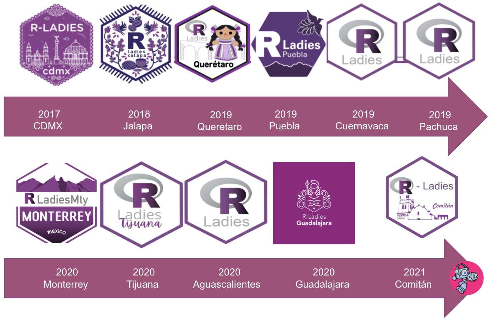
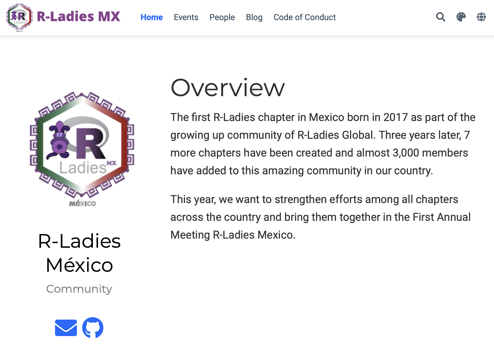
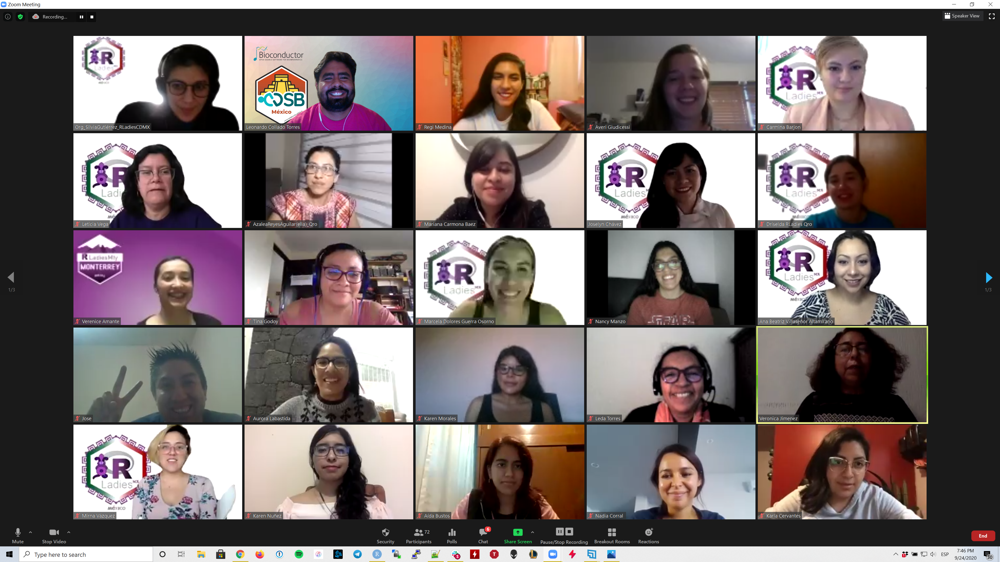
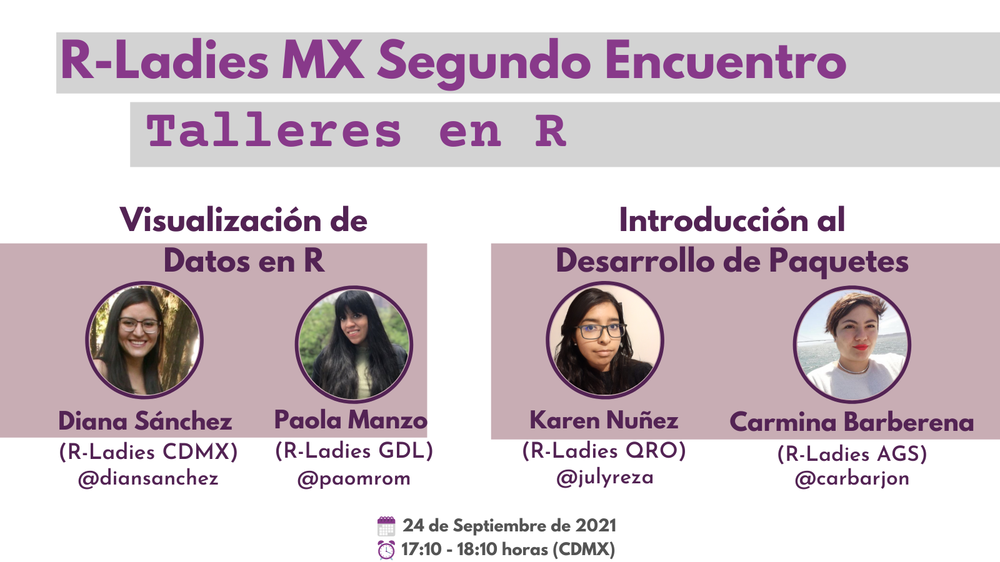
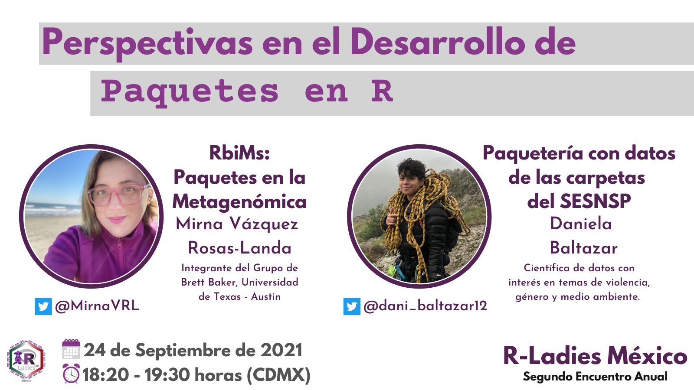
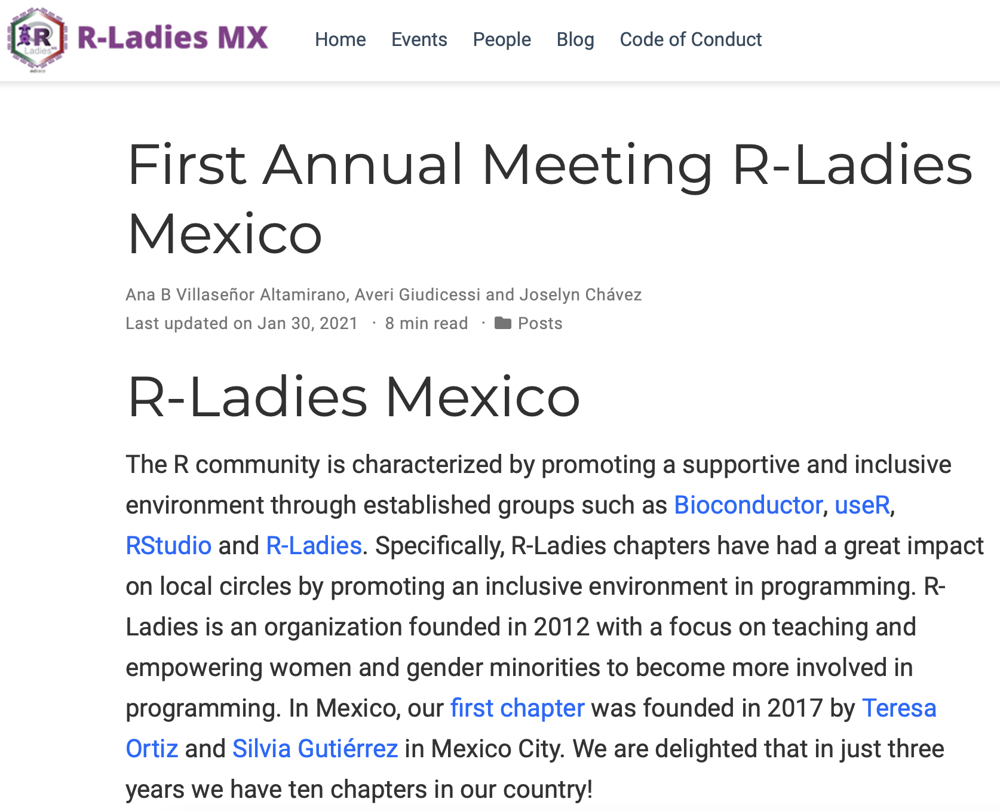
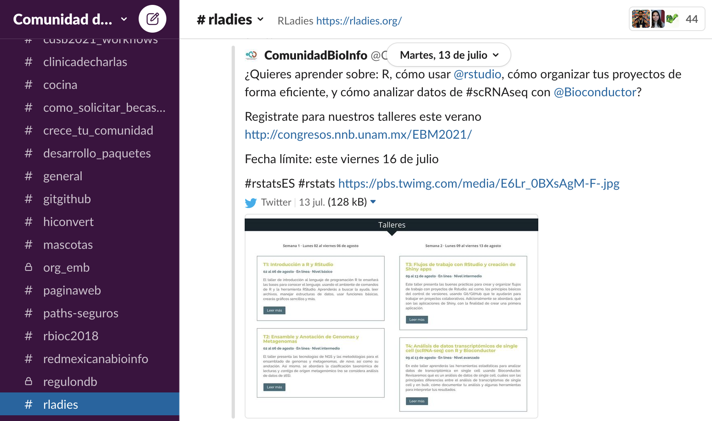
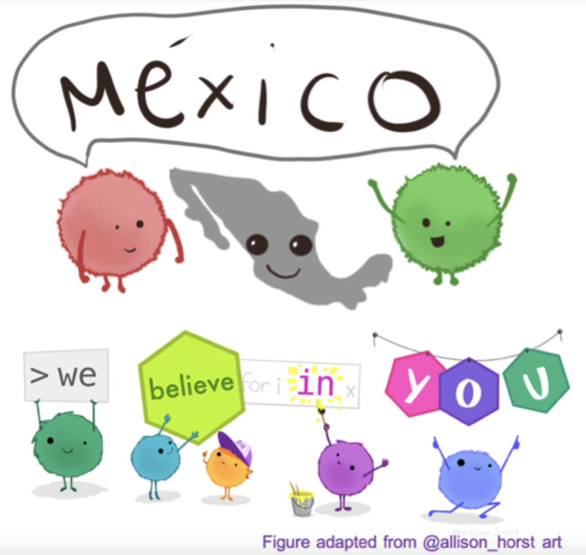

# The first Mexican chapter

.center[<br>
```{r,echo=FALSE,out.width='30%',fig.align='center'}

```

RLadies Cdmx, 2017
]

---
# More chapters borned

```{r,echo=FALSE,out.width='70%',fig.align='center'}

```

---
# The first annual meeting

.pull-left[<br>
```{r,echo=FALSE,out.width='100%',fig.align='center'}

```
<br>
.center[<https://rladiesmx.netlify.app>]
]

.pull-right[<br><br>
```{r,echo=FALSE,out.width='100%',fig.align='center'}

```
]

---
# The annual meeting 2021

.pull-left[
```{r,echo=FALSE,out.width='90%',fig.align='center'}

```
```{r,echo=FALSE,out.width='90%',fig.align='center'}

```
]

.pull-right[<br><br>
```{r,echo=FALSE,out.width='100%',fig.align='center'}
knitr::include_graphics("fig/rladiesmx2021_2.png")
```
]

---
# Blog posts

.pull-left[<br>
```{r,echo=FALSE,out.width='100%',fig.align='center'}

```
]

.pull-right[<br>
.center[<br>
## Comming soon... 

### Blog post 2021
]
]

---
# Join us!

.pull-left[
```{r,echo=FALSE,out.width='30%',fig.align='center'}

```

```{r,echo=FALSE,out.width='100%',fig.align='center'}

```

<https://bit.ly/slack_rladiesmx>
]

.pull-right[
```{r,echo=FALSE,out.width='114%',fig.align='center'}

```

.center[<https://bit.ly/rladiesmx>]
]

---
<br>

.pull-left[<br><br>
# Thanks for your attention!
]

.pull-right[
```{r,echo=FALSE,out.width='100%',fig.align='center'}

```
]
