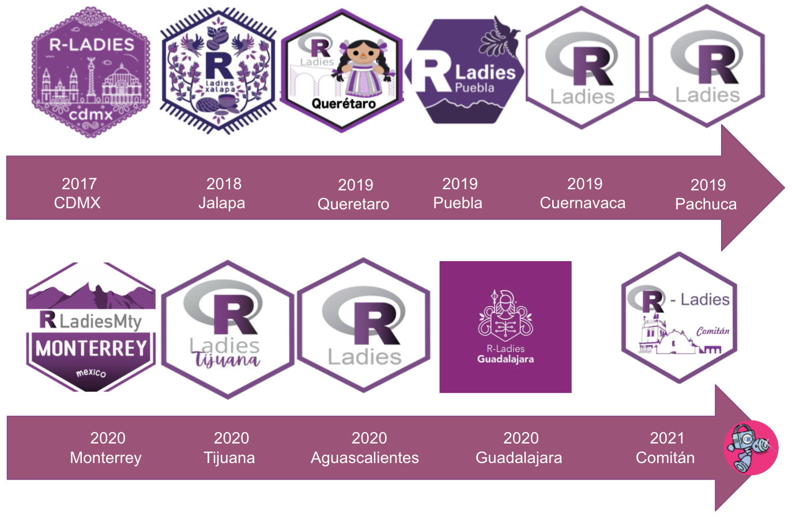
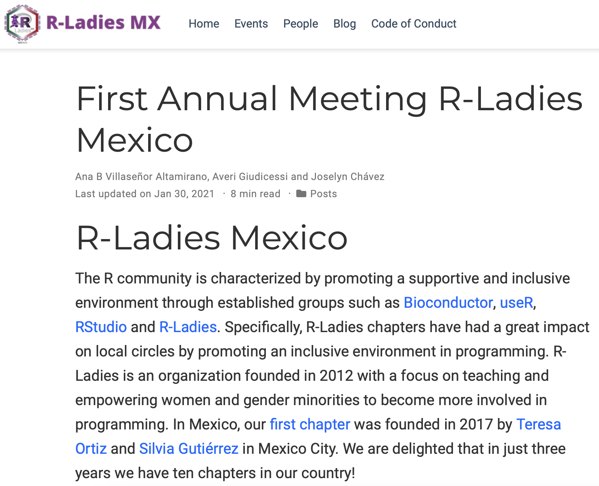
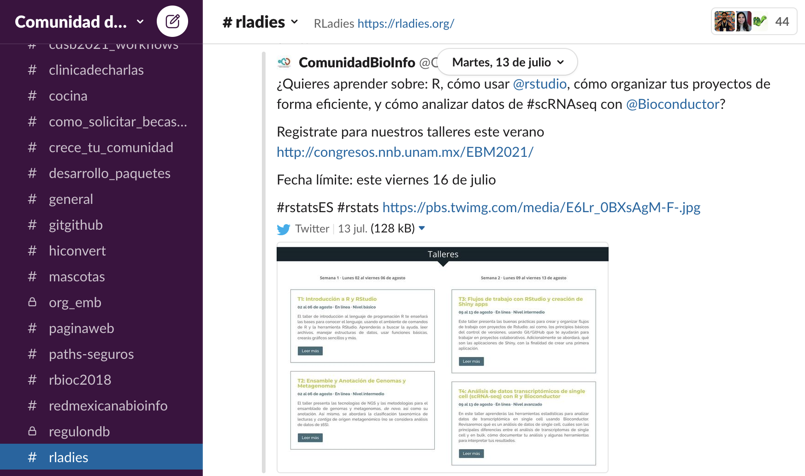

# The first Mexican chapter

.center[<br>
```{r,echo=FALSE,out.width='40%',fig.align='center'}

```

RLadies Cdmx, 2017
]

---
# More chapters borned

```{r,echo=FALSE,out.width='100%',fig.align='center'}

```

---
# The first annual meeting

.pull-left[<br>
```{r,echo=FALSE,out.width='100%',fig.align='center'}
knitr::include_graphics("fig/rladiesmxpage.png")
```
<br>

]

.pull-right[<br><br>
```{r,echo=FALSE,out.width='100%',fig.align='center'}
knitr::include_graphics("fig/rladiesmx2020.png")
```
]

.center[<https://rladiesmx.netlify.app>]

---
# The annual meeting 2021

.pull-left[<br>
```{r,echo=FALSE,out.width='100%',fig.align='center'}
knitr::include_graphics("fig/talleresen_R.png")
```

```{r,echo=FALSE,out.width='100%',fig.align='center'}
knitr::include_graphics("fig/paquetes_R.png")
```
]

.pull-right[<br><br><br>
```{r,echo=FALSE,out.width='100%',fig.align='center'}
knitr::include_graphics("fig/rladiesmx2021_2.png")
```
]

---
# Blog posts

.pull-left[<br>
```{r,echo=FALSE,out.width='100%',fig.align='center'}

```
]

.pull-right[
.center[<br>
## Comming soon... 

### Blog post 2021
]
]

---
# Join us!

.pull-left[<br>
```{r,echo=FALSE,out.width='30%',fig.align='center'}
knitr::include_graphics("fig/slack_logo.png")
```

```{r,echo=FALSE,out.width='100%',fig.align='center'}

```

]

.pull-right[<br>
```{r,echo=FALSE,out.width='110%',fig.align='center'}
knitr::include_graphics("fig/rladiesmxyoutube.png")
```

]

.center[
<https://bit.ly/slack_rladiesmx>

<https://bit.ly/rladiesmx>
]

---
<br>

.pull-left[<br><br>
.center[
# Thanks for your attention!
]
]

.pull-right[
```{r,echo=FALSE,out.width='120%',fig.align='center'}
knitr::include_graphics("fig/mexico.png")
```
]
